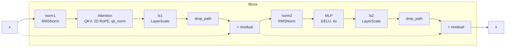

# ViT-5: Vision Transformers for The Mid-2020s — Single-File reimplementation for Swarms Corporation.

**Self-contained PyTorch reimplementation with full checkpoint parity and empirical evaluation of resolution robustness versus ViT-B/16.**

---

## Abstract

We provide a single-file PyTorch implementation of ViT-5 that matches the [official codebase](https://github.com/wangf3014/ViT-5) in forward pass and checkpoint loading (logit cosine similarity **1.000**). Using this implementation we evaluate **resolution robustness** (train at 224, evaluate at 256, 384, 448) and compare ViT-5-base to vanilla ViT-B/16. On a 1k-sample ImageNet-style validation subset, ViT-5 maintains Acc@1 better at higher resolutions: at **448**, ViT-5-base yields **8.0%** Acc@1 versus **7.3%** for ViT-B/16, with a smaller drop from the 224 baseline. The repository includes scripts for classifier-head evaluation, linear probing on ImageNet-100, and a “train probe once at 224, eval at 384” protocol for fast replication.

---

## 1. Results

### 1.1 Checkpoint parity

The implementation is validated against the original ViT-5 model (from `ViT-5/`) using the same checkpoint and identical input. Outcome:

| Metric | Result |
|--------|--------|
| Logit cosine similarity (ours vs original) | **1.000000** |
| Parity threshold (≥ 0.999) | **OK** |
| Sanity (different input → different logits) | cos = 0.9995 (expected &lt; 1) |

Checkpoint loading: 188 state-dict keys; 164 matched after remapping; 24 missing keys are RoPE `inv_freq` buffers (recomputed at build time). No unexpected missing or extra keys.

### 1.2 Resolution scaling (classifier head)

Models were trained at **224**; evaluation is performed at **224, 256, 384, 448** on the same validation set (1,000 samples, batch size 32). Position embeddings are interpolated for non-224 resolutions.

**Table 1 — Acc@1, Acc@5, and loss by model and evaluation resolution.**

| Model     | Train res | Eval res | Acc@1 | Acc@5 | Loss   |
|-----------|-----------|----------|-------|-------|--------|
| ViT-5-base| 224       | 224      | 8.70  | 10.90 | 8.4088 |
| ViT-B/16  | 224       | 224      | 8.80  | 11.70 | 8.7345 |
| ViT-5-base| 224       | 256      | 8.50  | 10.40 | 8.4861 |
| ViT-B/16  | 224       | 256      | 8.50  | 11.60 | 8.8382 |
| ViT-5-base| 224       | 384      | 8.50  | 9.50  | 8.7240 |
| ViT-B/16  | 224       | 384      | 8.20  | 12.40 | 8.7928 |
| ViT-5-base| 224       | 448      | **8.00** | 9.40  | 8.8720 |
| ViT-B/16  | 224       | 448      | **7.30** | 10.40 | 8.9247 |

**Observation.** At 224 and 256 the two models are close in Acc@1. As resolution increases, ViT-5-base retains Acc@1 better: at **384** the gap is 8.50 vs 8.20; at **448** it widens to **8.00 vs 7.30** (−0.7 for ViT-5 from 224→448 vs −1.5 for ViT-B/16). This is consistent with the paper’s claim that APE and 2D RoPE improve resolution robustness, though the absolute numbers here are from a small subset (1k samples) and should be confirmed on full ImageNet validation.

### 1.3 Further evaluation (linear probe)

Additional protocols are provided to isolate **representation quality** (no pretrained head):

- **Linear probe per resolution** — Extract penultimate features, train a linear classifier on ImageNet-100 at each resolution; compare Acc@1/Acc@5 across resolutions.
- **Train probe once at 224, eval at 384** — Freeze backbone, train Linear(768→100) for 20 epochs at 224; report top-1 at 224 and at 384 with the same probe. Yields a compact resolution-robustness signal with moderate compute.

Run instructions for these protocols are given in §3.

---

## 2. Model and implementation

The core model is in **`vit5.py`**: patch embedding, learnable APE, cls and register tokens, transformer blocks with 2D RoPE and q/k normalization, RMSNorm, LayerScale, and classification head. Architectures `vit5_small`, `vit5_base`, `vit5_large`, `vit5_xlarge` match the official configs. Official checkpoints ([Hugging Face](https://huggingface.co/FengWang3211/ViT-5)) are loaded via `remap_official_state_dict` (e.g. `gamma_1`/`gamma_2` → `ls1.gamma`/`ls2.gamma`). RoPE `inv_freq` buffers are not in the checkpoint and are recomputed at build time.

**Figure 1 — Low-level forward pass (ViT-5).**

```mermaid
flowchart LR
    subgraph input["Input"]
        X["x (B,C,H,W)"]
    end
    subgraph embed["Embedding"]
        PE["PatchEmbed\nConv2d 16x16"]
        APE["+ pos_embed\n(APE)"]
        Concat["concat cls, patches, reg"]
    end
    subgraph stack["Transformer"]
        B1["Block 1"]
        B2["Block 2"]
        Bdots["..."]
        BL["Block L"]
    end
    subgraph out["Output"]
        Norm["RMSNorm"]
        Cls["x[:, 0]\n(cls token)"]
        Head["Linear\n768 → K"]
        Logits["logits (B, K)"]
    end
    X --> PE
    PE --> APE
    APE --> Concat
    Concat --> B1
    B1 --> B2
    B2 --> Bdots
    Bdots --> BL
    BL --> Norm
    Norm --> Cls
    Cls --> Head
    Head --> Logits
```



**Figure 2 — Single Block (norm → attn → residual, norm → MLP → residual).**



---

## 3. Reproducibility — setup and running

### 3.1 Environment and parity checks

```bash
pip install -r requirements.txt
python run_compile_and_test.py
pytest tests/ -v
```

**Parity with original repo** (requires `ViT-5/` and timm):

```bash
python scripts/compare_with_original.py path/to/vit5_base_patch16_224.pth
python scripts/compare_with_original.py path/to/vit5_base_patch16_224.pth -v   # verbose
```

**Parity tests** (with checkpoint):

```bash
VIT5_CHECKPOINT_PATH=path/to/vit5_base_patch16_224.pth pytest tests/test_parity.py -v
```

### 3.2 Resolution scaling (Table 1)

Requires ViT-5 checkpoint and a ViT-B/16 checkpoint (e.g. [timm vit_base_patch16_224.augreg2_in21k_ft_in1k](https://huggingface.co/timm/vit_base_patch16_224.augreg2_in21k_ft_in1k); clone repo and run `git lfs pull`, then use `model.safetensors` with `pip install safetensors`).

```bash
python scripts/benchmark_resolution.py \
  --vit5-ckpt vit5_base_patch16_224.pth \
  --vitb-ckpt path/to/vitb.safetensors \
  --data-path /path/to/imagenet \
  -v
```

Use `--max-samples 1000` (or other value) to match the 1k-sample setting above; optional `--output-csv out.csv`. For GPU: `--device cuda`.

### 3.3 Linear probe (ImageNet-100)

**Per-resolution probe:**  
`scripts/benchmark_resolution_linear_probe.py` — `--data-path` to ImageNet-100 (train/ and val/ with 100 classes), `--resolutions 224 256 384 448`, `--probe-epochs 30`.

**Train once at 224, eval at 224 and 384:**  
`scripts/benchmark_linear_probe_train_once.py` — same data path, `--probe-epochs 20`, `--eval-resolutions 224 384`.

---

## 4. Tests

- **Stress:** `pytest tests/test_stress.py -v` — resolutions 224 and 384, large batch, mixed precision.
- **Full suite:** `pytest tests/ -v` — unit, parity (with checkpoint), and stress; `torch.compile` tests when a C++ compiler is available.

---

## References and links

- Official ViT-5: [github.com/wangf3014/ViT-5](https://github.com/wangf3014/ViT-5)
- ViT-5 checkpoints: [Hugging Face – FengWang3211/ViT-5](https://huggingface.co/FengWang3211/ViT-5)
- ViT-B/16 baseline: [Hugging Face – timm/vit_base_patch16_224.augreg2_in21k_ft_in1k](https://huggingface.co/timm/vit_base_patch16_224.augreg2_in21k_ft_in1k)
